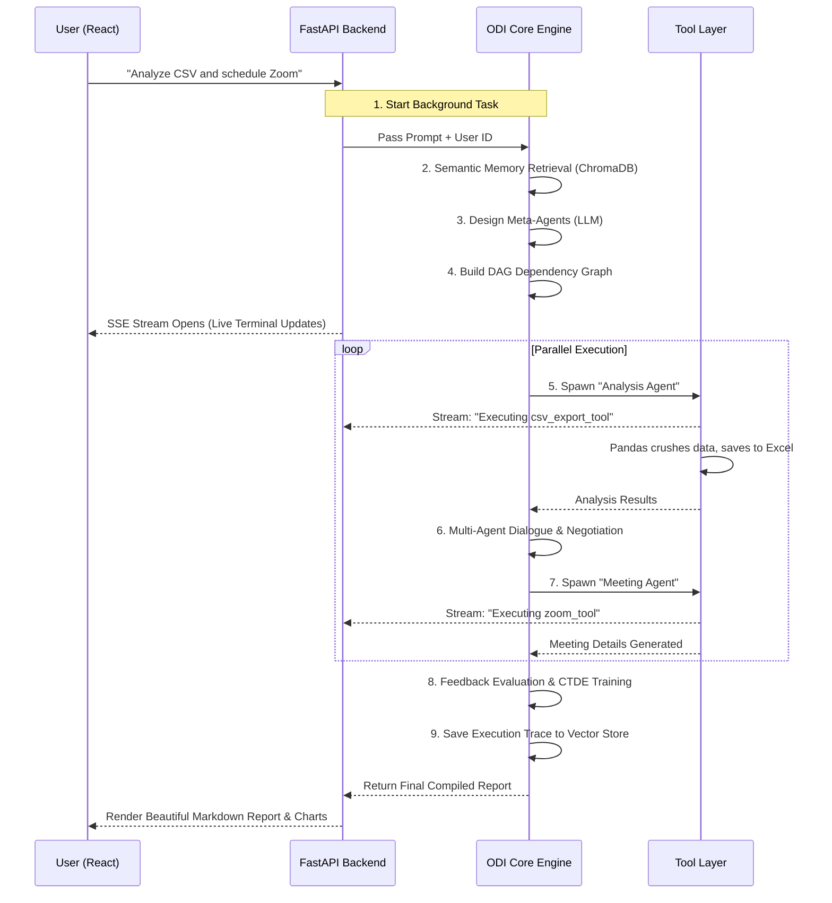

# ⚡ AutoOpsAI: The Autonomous AI Workforce

> **AutoOpsAI** is an Enterprise-grade Multi-Agent AI Workflow Automation Platform. It translates plain English into a dynamic workforce of AI agents that can analyze data, schedule meetings, send emails, and collaborate—all in real-time.

---

## 📖 The Story: Why AutoOpsAI?

Imagine you run a massive logistics company. You receive a raw, messy CSV file downloaded from your vendor containing hundreds of shipment delays. 

Normally, fixing this requires an entire department:
1. **The Data Analyst** to crunch the numbers in Excel.
2. **The Project Manager** to read the analysis and write a summary.
3. **The Secretary** to schedule a Zoom meeting for the engineering team and broadcast the link on Slack.

This takes hours of human coordination. 

**With AutoOpsAI, it takes 30 seconds.** 
You simply type: *"Analyze this CSV, write a summary report, and schedule a Zoom meeting with the engineering team to discuss the delays."*

AutoOpsAI doesn't just run a rigid Python script. It dynamically **spawns** a Data Analyst AI, a Manager AI, and a Secretary AI. It gives them tools (Pandas, Zoom OAuth, Slack API). It watches them coordinate, share data, and complete the job while you watch their thoughts stream live on a beautiful dashboard.

---

## 🧠 The Novelty: The ODI Core Engine

The true magic of AutoOpsAI lies in its brain: the **ODI (Observe, Delegate, Intervene) Multi-Agent Framework**. 

Unlike standard linear chatbots, our ODI Engine gives agents autonomy and memory:

*   **Observe:** The engine reads the prompt, searches ChromaDB vector memory for past contextual workflows, and observes the available Tool Catalog.
*   **Delegate:** It maps out a Directed Acyclic Graph (DAG). It realizes the *Secretary Agent* cannot act until the *Analysis Agent* finishes crunching the CSV. It delegates tasks in the exact optimal order.
*   **Intervene:** (CTDE - Centralized Training, Decentralized Execution). The MetaOrchestrator watches the agents talk to each other. If an agent hallucinates or crashes, the orchestrator intervenes, evaluates feedback, and updates shared policies.

---

## 🏗️ System Architecture

AutoOpsAI is built on a decoupled, highly scalable architecture. The brain (ODI) is completely isolated from the body (FastAPI & React), connected only via a secure Orchestrator Service.

```mermaid
graph TD
    %% Styling
    classDef frontend fill:#3b82f6,stroke:#1e3a8a,stroke-width:2px,color:#fff
    classDef backend fill:#10b981,stroke:#064e3b,stroke-width:2px,color:#fff
    classDef brain fill:#a855f7,stroke:#581c87,stroke-width:2px,color:#fff
    classDef db fill:#f59e0b,stroke:#78350f,stroke-width:2px,color:#fff

    User((👤 User)) -->|Uploads CSV & Prompt| Browser

    subgraph "🎨 Frontend (React + Vite)"
        Browser[React UI Dashboard]:::frontend
        SSE[Live SSE Terminal]:::frontend
    end

    Browser -->|JWT Authorized POST| FastAPI

    subgraph "⚙️ Backend (FastAPI)"
        FastAPI[API Router & Auth]:::backend
        Orchestrator[Orchestrator Service]:::backend
        ToolsLayer[Tool Execution Layer<br>(Zoom, Slack, Pandas, SMTP)]:::backend
        FastAPI --> Orchestrator
        Orchestrator <--> ToolsLayer
    end

    subgraph "🧠 Core Engine (ODI Framework)"
        Meta[MetaOrchestrator]:::brain
        DAG[DAG Resolver]:::brain
        Agents[Agent Factory]:::brain
        Meta --> DAG --> Agents
    end

    Orchestrator <-->|Prompt & File IDs| Meta
    
    subgraph "🗄️ Persistence"
        PG[(PostgreSQL / Supabase)]:::db
        Chroma[(ChromaDB Vector Memory)]:::db
    end

    FastAPI --> PG
    Meta <--> Chroma
    ToolsLayer --> SSE
```

---

## ⚙️ How It Works (The 9-Step Pipeline)

When you click "Run Pipeline," our Orchestrator triggers the 9-step ODI lifecycle.



---

## 🔨 Available AI Tools

The LLM is strictly prompted with our custom **Tool Catalog**. It natively understands *when* to equip an agent with a tool.

| Tool Vault | Capabilities |
|-----------|--------------|
| 📊 **csv_export_tool** | Bypasses simple reading. Generates a multi-sheet Excel file with correlations, distributions, and statistical summaries. |
| 📑 **report_tool** | Compiles upstream data into beautiful, human-readable markdown formats. |
| 📧 **email_tool** | SMTP integration to dynamically dispatch emails to teams. |
| 💬 **slack_tool** | API-driven Slack webhook broadcasting. |
| 📹 **zoom_tool** | Secure OAuth Zoom meeting creation with password-protected invites. |
| 📅 **calendar_tool** | Postgres-backed scheduling database. |

---

## 🚀 Quickstart Guide

### Prerequisites
- Python 3.9+
- Node.js (React/Vite)
- PostgreSQL (or Supabase)
- Groq / OpenAI API Keys

### 1. Launch the Backend
```bash
cd backend
python3 -m venv venv
source venv/bin/activate
pip install -r requirements.txt

# Configure your environment variables
cp .env.example .env

# Run FastAPI Server
python -m uvicorn app.main:app --host 0.0.0.0 --port 8000 --reload
```
docker-compose up -d --build


### 2. Launch the Frontend
```bash
cd frontend-react
npm install
npm run dev
```
Open [http://localhost:5173](http://localhost:5173) and experience the power of an autonomous workforce! 

---


Analyse this csv file and send the generated result report to my engineering & management team, also schedule a meeting with engineering and management team at 9pm on 29 april and agenda of meet is next month resposiblities


# 🏆 Brownie Concepts Implemented

To ensure enterprise-readiness and satisfy advanced technical requirements, the following core software concepts are natively implemented:

### 1. CRUD Operations
We built a full Human-in-the-Loop Governance dashboard to Create, Read, Update, and Delete AI memory. Instead of manually writing policies to raw JSON files, the data is stored in the database with proper security.
*   **Backend**: `backend/app/routes/governance.py` manages the RESTful CRUD endpoints connecting to PostgreSQL.
*   **Frontend**: `frontend-react/src/pages/Governance.jsx` provides the UI for editing/deleting rules.
*   **Engine**: `ODI-based-multi-agent-Framework/adaptation/learning_store.py` securely hooks into this database to fetch the ruled behaviors.

### 2. Idempotency
We secured the platform across multiple architectural layers to ensure safe operations and block duplicate side outputs.
*   **Database Level**: `backend/seed_ctde_tables.py` enforces a composite `UNIQUE(agent_role, category, rule_text)` constraint. Utilizing an `ON CONFLICT DO NOTHING` SQL clause, identical AI-learned policies are safely ignored to prevent bloat.
*   **Backend Level**: `backend/app/routes/manager.py` checks for existing team assignments (`SELECT id FROM team_members`) before inserting, safely bouncing duplicate manager requests.
*   **Frontend Level**: `frontend-react/src/pages/Workflow.jsx` uses React state (`status === 'running'`) to instantly disable execution buttons, preventing API-token double-billing.

### 3. HTTPS / Secure Communication
All traffic is routed through a secure, containerized reverse proxy.
*   **Implementation Location**: `nginx/nginx.conf` and `docker-compose.yml`. SSL certificates are mapped to the proxy to enforce outbound and inbound payload encryption.

### 4. Password Hashing
Raw passwords are never stored in the database.
*   **Implementation Location**: `backend/app/core/security.py` uses the standard enterprise `bcrypt` library to securely hash passwords (`get_password_hash`) and verify them during login, ensuring total database breach security.

### 5. Protected APIs (Role-Based Access Control)
Not all users should be able to view org-wide analytics or enforce AI governance.
*   **Implementation Location**: `backend/app/routes/manager.py` and `backend/app/routes/governance.py` both utilize FastAPI Depends injection on `require_manager()`, restricting access purely to JWT tokens verified as 'manager' or 'admin' roles.

### 6. Prevent Common Exceptions (Fault Tolerance)
AI workflows are notoriously brittle. We built custom exception handlers so the entire backend server doesn't crash when an external API fails.
*   **Implementation Location**: `backend/app/services/orchestrator_service.py` safely wraps the execution blocks with `try/except` captures. If Groq throws a Rate Limit 429 error or an agent hallucinates unparseable JSON, the pipeline streams the isolated error directly across the SSE channel rather than causing a fatal Uvicorn server crash.

### 7. Multi-Factor Authentication (Email OTP)
To protect against brute-force attacks and credential stuffing, we implemented a custom SMTP-based MFA system.
*   **Database Level**: Dynamic `otp_codes` table to securely track rolling 6-digit codes and their 5-minute expiration windows. 
*   **Backend Level**: `backend/app/routes/auth.py` halts standard JWT issuance upon login, asynchronously sends an SMTP email (`send_otp_email`), and requires explicit `/verify-otp` confirmation. The `otp_verified` flag is cryptographically embedded into the session token via `backend/app/core/security.py`.
*   **Frontend Level**: `frontend-react/src/pages/OTPVerification.jsx` catches the MFA signal and visually renders a secure code-entry portal to intercept unauthorized access.

test = analyse the csv, and send the report to my engineering & sales team, arrange a meeting with them on 20 april 9 pm , agenda is langchain